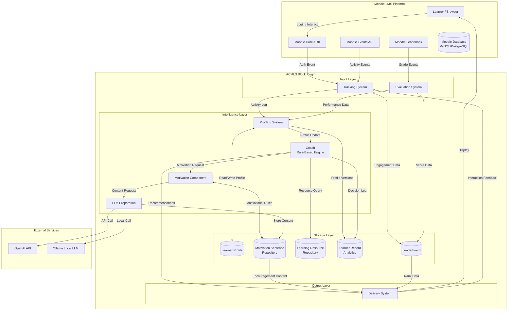
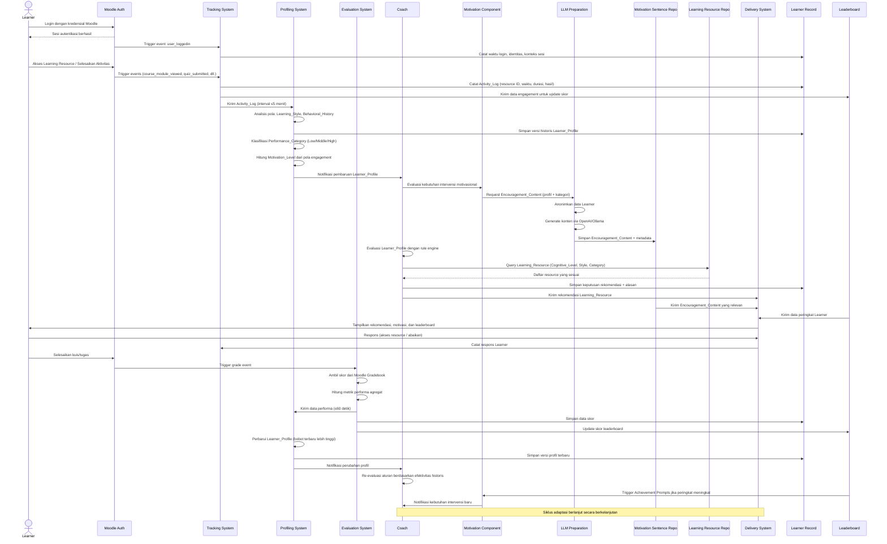
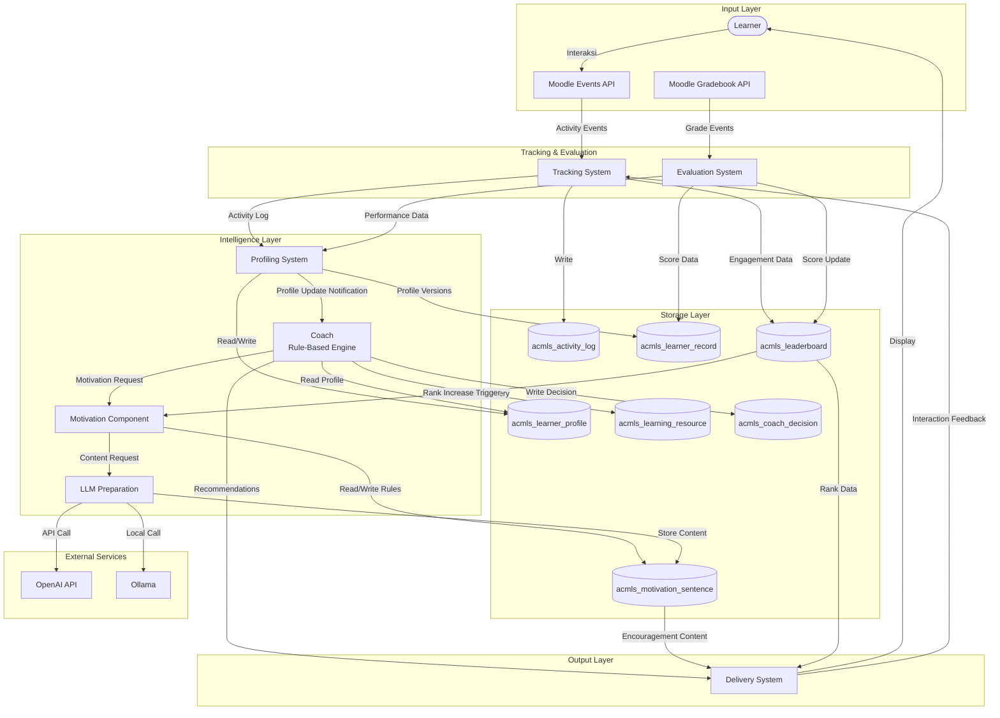

# Dokumen Desain Teknis

## Adaptive Cognitive-Motivational Learning System (ACMLS)
### Plugin Moodle: `block_attendanceleaderboard`

---

## A. System Overview

ACMLS (*Adaptive Cognitive-Motivational Learning System*) adalah ekosistem pembelajaran adaptif yang dibangun di atas platform Moodle LMS. Sistem ini mengadopsi pendekatan *hybrid adaptive learning* yang menggabungkan tiga lapisan kecerdasan: (1) *rule-based recommendation engine* (Coach), (2) *large language model* (LLM) untuk generasi konten motivasional yang dipersonalisasi, dan (3) *learning analytics* berbasis data historis longitudinal.

Arsitektur sistem dirancang untuk mendukung dua tujuan utama yang saling melengkapi: pertama, meningkatkan efektivitas pembelajaran melalui adaptasi konten dan intervensi motivasional yang dipersonalisasi; kedua, menyediakan infrastruktur penelitian yang memungkinkan pengumpulan dan analisis data pembelajaran secara sistematis untuk keperluan tesis magister/doktoral.

Sistem beroperasi sebagai *block plugin* Moodle (`block_attendanceleaderboard`) yang terintegrasi penuh dengan ekosistem Moodle, memanfaatkan Moodle Database Abstraction Layer (DBAL), Moodle Events API, Moodle Privacy API, dan Moodle Gradebook API.

### Diagram Arsitektur Tingkat Tinggi



---

## B. Detailed Component Design

### B.1. Learner Entity

**Fungsi:** Merepresentasikan peserta didik yang terdaftar dan aktif berinteraksi dengan sistem ACMLS melalui antarmuka Moodle.

**Input:** Kredensial autentikasi Moodle, interaksi antarmuka (klik, akses resource, pengiriman tugas).

**Output:** Event aktivitas yang diteruskan ke Tracking System, respons terhadap Adaptive_Intervention.

**Interaksi:** Berinteraksi dengan Moodle Core Auth untuk autentikasi, dengan Delivery System untuk menerima konten dan rekomendasi, dan dengan Tracking System melalui Moodle Events API.

**Signifikansi Edukatif:** Learner adalah subjek utama sistem adaptif. Pemodelan Learner yang akurat dan multidimensional merupakan fondasi dari seluruh mekanisme adaptasi. Dalam konteks penelitian, Learner menjadi unit analisis utama dalam studi efektivitas intervensi adaptif.

---

### B.2. Tracking System

**Fungsi:** Mengumpulkan, memvalidasi, dan meneruskan seluruh data aktivitas digital Learner di LMS secara real-time.

**Input:** Moodle Events (login, logout, course_module_viewed, quiz_attempt_submitted, forum_post_created, dll.), data sesi pengguna.

**Output:** Activity_Log terstruktur yang dikirimkan ke Profiling System dan Leaderboard.

**Interaksi:** Berlangganan (*subscribe*) ke Moodle Events API menggunakan mekanisme `\core\event\base`. Mengirimkan data ke Profiling System dalam interval ≤5 menit. Menyimpan log ke tabel `acmls_activity_log` via Moodle DBAL.

**Signifikansi Edukatif:** Tracking System menyediakan *behavioral data* yang menjadi dasar pemodelan pola belajar Learner. Data ini memungkinkan deteksi dini tanda-tanda disengagement dan penurunan motivasi, yang merupakan indikator kritis dalam penelitian *learning analytics*.

---

### B.3. Profiling System

**Fungsi:** Membangun, memperbarui, dan memelihara model multidimensional setiap Learner secara dinamis berdasarkan data dari Tracking System dan Evaluation System.

**Input:** Activity_Log dari Tracking System, data performa dari Evaluation System, konfigurasi algoritma profiling dari administrator.

**Output:** Learner_Profile yang diperbarui (mencakup Cognitive_Level, Academic_Performance, Motivation_Level, Learning_Style, Behavioral_History), notifikasi pembaruan ke Coach, versi historis profil ke Learner Record.

**Interaksi:** Menerima data dari Tracking System dan Evaluation System. Menulis ke tabel `acmls_learner_profile` dan `acmls_learner_record`. Mengirimkan notifikasi ke Coach melalui event internal ACMLS.

**Signifikansi Edukatif:** Profiling System mengimplementasikan konsep *learner modeling* yang merupakan komponen inti dari *Intelligent Tutoring Systems* (ITS). Model multidimensional yang dihasilkan memungkinkan personalisasi yang lebih akurat dibandingkan sistem adaptif berbasis satu dimensi (misalnya, hanya berbasis nilai akademik).

---

### B.4. Coach (Rule-Based Engine)

**Fungsi:** Bertindak sebagai pengontrol adaptasi pusat yang mengevaluasi Learner_Profile dan menentukan Adaptive_Intervention yang optimal menggunakan *rule-based reasoning*.

**Input:** Learner_Profile yang diperbarui, katalog Learning_Resource, riwayat intervensi dari Learner Record, posisi Leaderboard Learner.

**Output:** Rekomendasi Learning_Resource yang dipersonalisasi, permintaan intervensi motivasional ke Motivation Component, keputusan rekomendasi yang tersimpan di Learner Record.

**Interaksi:** Menerima notifikasi dari Profiling System. Mengirimkan query ke Learning Resource Repository. Mengirimkan permintaan ke Motivation Component. Menyimpan keputusan ke `acmls_coach_decision`. Mengirimkan rekomendasi ke Delivery System.

**Signifikansi Edukatif:** Coach mengimplementasikan *pedagogical knowledge* dalam bentuk aturan yang dapat diaudit dan dimodifikasi. Pendekatan *rule-based* dipilih untuk memastikan transparansi dan *explainability* dari keputusan adaptif — aspek yang krusial dalam konteks penelitian pendidikan dan akuntabilitas pedagogis.

---

### B.5. LLM Preparation

**Fungsi:** Menghasilkan konten motivasional (*Encouragement_Content*) yang dipersonalisasi menggunakan Large Language Model, dengan mekanisme fallback ke template statis.

**Input:** Konteks Learner (Performance_Category, Motivation_Level, pola keterlibatan, riwayat pembelajaran), kategori konten yang diminta oleh Motivation Component, konfigurasi LLM (provider, model, API key).

**Output:** Encouragement_Content dalam bahasa Indonesia formal-akademik, tersimpan di Motivation_Sentence_Repository beserta metadata.

**Interaksi:** Menerima permintaan dari Motivation Component. Memanggil OpenAI API atau Ollama (sesuai konfigurasi). Menganonimkan data Learner sebelum pengiriman ke layanan eksternal. Menyimpan hasil ke `acmls_motivation_sentence`.

**Signifikansi Edukatif:** Integrasi LLM memungkinkan generasi konten motivasional yang kontekstual dan bervariasi, mengatasi keterbatasan template statis yang cenderung monoton dan kehilangan efektivitas seiring waktu. Ini merepresentasikan aplikasi *generative AI* dalam konteks *educational intervention*.

---

### B.6. Motivation Component

**Fungsi:** Mendefinisikan dan mengelola logika motivasional, menentukan kapan dan jenis intervensi motivasional apa yang harus diberikan kepada Learner.

**Input:** Learner_Profile (khususnya Motivation_Level dan pola keterlibatan), data Leaderboard, konfigurasi ambang batas motivasional dari administrator.

**Output:** Permintaan intervensi motivasional ke LLM Preparation atau Motivation_Sentence_Repository, pencatatan respons Learner terhadap intervensi.

**Interaksi:** Membaca Learner_Profile dari Profiling System. Berinteraksi dengan LLM Preparation untuk generasi konten baru. Membaca dari dan menulis ke Motivation_Sentence_Repository. Mencatat respons ke Learner Record.

**Signifikansi Edukatif:** Motivation Component mengimplementasikan teori motivasi belajar (Self-Determination Theory, Achievement Goal Theory) dalam bentuk aturan komputasional. Komponen ini memungkinkan sistem untuk memberikan dukungan motivasional yang tepat waktu dan tepat sasaran, yang merupakan salah satu faktor kritis dalam keberhasilan pembelajaran online.

---

### B.7. Motivation Sentence Repository

**Fungsi:** Menyimpan, mengindeks, dan menyediakan akses cepat ke konten motivasional (*Encouragement_Content*) yang telah dihasilkan oleh LLM Preparation maupun template statis.

**Input:** Encouragement_Content dari LLM Preparation, operasi CRUD dari administrator, query dari Motivation Component.

**Output:** Encouragement_Content yang paling relevan untuk Learner tertentu, riwayat pengiriman konten per Learner.

**Interaksi:** Menerima konten dari LLM Preparation. Melayani query dari Motivation Component. Menyimpan riwayat pengiriman untuk mencegah duplikasi. Mengirimkan notifikasi kapasitas ke administrator.

**Signifikansi Edukatif:** Repositori ini memungkinkan akumulasi *corpus* konten motivasional yang dapat dianalisis untuk penelitian tentang efektivitas berbagai jenis pesan motivasional pada populasi Learner yang berbeda.

---

### B.8. Delivery System

**Fungsi:** Menampilkan rekomendasi Learning_Resource, Encouragement_Content, dan Leaderboard kepada Learner melalui antarmuka Moodle yang terintegrasi.

**Input:** Rekomendasi dari Coach, Encouragement_Content dari Motivation_Sentence_Repository, data Leaderboard, konfigurasi tampilan dari administrator.

**Output:** Tampilan antarmuka Moodle (blok plugin, notifikasi, dashboard), data interaksi Learner yang dikirimkan kembali ke Tracking System.

**Interaksi:** Menerima data dari Coach, Motivation_Sentence_Repository, dan Leaderboard. Merender tampilan menggunakan Moodle Mustache templates. Mengirimkan data interaksi ke Tracking System. Mendukung berbagai format penyampaian (blok halaman, notifikasi, pesan).

**Signifikansi Edukatif:** Delivery System adalah titik kontak langsung antara sistem adaptif dan Learner. Desain antarmuka yang efektif dan non-intrusif merupakan faktor penting dalam penerimaan pengguna (*user acceptance*) terhadap sistem adaptif.

---

### B.9. Evaluation System

**Fungsi:** Mengambil dan memproses data penilaian akademik Learner dari Moodle Gradebook, menghitung metrik performa agregat, dan mendeteksi penurunan performa yang signifikan.

**Input:** Grade events dari Moodle Gradebook API, konfigurasi ambang batas penurunan performa.

**Output:** Metrik performa agregat yang dikirimkan ke Profiling System, sinyal peringatan ke Coach saat penurunan >20%, data skor ke Learner Record dan Leaderboard.

**Interaksi:** Berlangganan ke Moodle grade-related events. Membaca data dari Moodle Gradebook API. Mengirimkan data ke Profiling System dalam ≤60 detik. Menyimpan data ke `acmls_learner_record`.

**Signifikansi Edukatif:** Evaluation System menjembatani sistem penilaian formal Moodle dengan mekanisme adaptasi ACMLS, memastikan bahwa adaptasi didasarkan pada data performa akademik yang valid dan terstandarisasi.

---

### B.10. Learning Resource Repository

**Fungsi:** Menyimpan metadata sumber belajar yang tersedia di Moodle dan menyediakan mekanisme query berbasis parameter Learner_Profile untuk mendukung rekomendasi Coach.

**Input:** Metadata sumber belajar dari Moodle (judul, jenis, tingkat kesulitan, topik, tag), query rekomendasi dari Coach, operasi manajemen dari instruktur.

**Output:** Daftar Learning_Resource yang sesuai dengan parameter query, data penggunaan resource untuk analitik.

**Interaksi:** Mengindeks sumber belajar Moodle secara otomatis saat resource baru ditambahkan. Melayani query dari Coach dalam ≤3 detik. Menyimpan data penggunaan untuk peningkatan kualitas rekomendasi.

**Signifikansi Edukatif:** Repositori ini memungkinkan pengelolaan katalog sumber belajar yang terstruktur dan dapat diquery secara efisien, mendukung rekomendasi yang berbasis pada karakteristik konten dan kebutuhan Learner.

---

### B.11. Learner Record (Analytics Repository)

**Fungsi:** Menyimpan seluruh data historis pembelajaran Learner secara komprehensif untuk mendukung analisis longitudinal, audit sistem, dan penelitian berbasis data.

**Input:** Data dari Profiling System (versi historis profil), Evaluation System (data skor), Tracking System (activity logs), Coach (keputusan rekomendasi).

**Output:** Laporan analitik longitudinal, ekspor data dalam format CSV/JSON, respons query analitik dari peneliti/administrator.

**Interaksi:** Menerima data dari semua komponen sistem. Menyediakan antarmuka query untuk administrator dan peneliti. Menerapkan role-based access control sesuai kebijakan privasi Moodle. Mendukung ekspor data untuk analisis eksternal.

**Signifikansi Edukatif:** Learner Record adalah komponen yang paling kritis untuk tujuan penelitian. Data longitudinal yang tersimpan memungkinkan analisis efektivitas intervensi adaptif, identifikasi pola belajar, dan validasi model prediktif — semua aspek yang esensial dalam penelitian *learning analytics* dan *educational data mining*.

---

### B.12. Leaderboard

**Fungsi:** Menghitung, menyimpan, dan menyajikan peringkat Learner berdasarkan metrik gabungan kehadiran, keterlibatan, dan penyelesaian aktivitas untuk mendorong motivasi kompetitif.

**Input:** Data aktivitas dari Tracking System (frekuensi login, akses resource), data penyelesaian aktivitas dari Evaluation System, konfigurasi bobot metrik dan privasi dari administrator.

**Output:** Data peringkat Learner (posisi, skor total, perubahan peringkat, jarak poin), trigger Achievement Prompts ke Motivation Component saat peringkat meningkat.

**Interaksi:** Menerima data dari Tracking System dan Evaluation System. Memperbarui peringkat dalam interval ≤15 menit. Mengirimkan data ke Delivery System untuk tampilan. Memicu Motivation Component saat terjadi peningkatan peringkat.

**Signifikansi Edukatif:** Leaderboard mengimplementasikan elemen *gamification* yang telah terbukti efektif dalam meningkatkan motivasi ekstrinsik Learner. Integrasi Leaderboard dengan sistem motivasional ACMLS memungkinkan penelitian tentang interaksi antara motivasi kompetitif dan intervensi motivasional personal.

---

## C. Workflow (11 Langkah)

Berikut adalah alur lengkap sistem ACMLS dari login Learner hingga pembaruan profil berkelanjutan.

### Sequence Diagram Alur Utama



### Deskripsi Langkah-Langkah

**Langkah 1 — Learner Login:** Learner mengautentikasi diri melalui mekanisme login Moodle yang sudah ada. Setelah autentikasi berhasil, Tracking System mencatat event login beserta timestamp dan konteks sesi ke Activity_Log.

**Langkah 2 — Activity Tracking:** Selama sesi aktif, Tracking System berlangganan ke seluruh Moodle Events yang relevan dan mencatat setiap interaksi Learner (akses resource, penyelesaian aktivitas, partisipasi forum) ke Activity_Log secara real-time.

**Langkah 3 — Student Profiling:** Profiling System menerima Activity_Log dari Tracking System dalam interval ≤5 menit, menganalisis pola perilaku, dan memperbarui dimensi Learner_Profile (Learning_Style, Behavioral_History, Motivation_Level).

**Langkah 4 — Initial Classification:** Profiling System mengklasifikasikan Performance_Category Learner (Low/Middle/High) berdasarkan data akademik dan pola engagement, kemudian mengirimkan notifikasi pembaruan ke Coach.

**Langkah 5 — LLM Motivational Generation:** Coach mengevaluasi kebutuhan intervensi motivasional dan meminta Motivation Component untuk menghasilkan Encouragement_Content yang dipersonalisasi melalui LLM Preparation.

**Langkah 6 — Rule-Based Coaching:** Coach mengevaluasi Learner_Profile menggunakan rule engine dan menentukan Learning_Resource yang paling sesuai berdasarkan kombinasi Cognitive_Level, Performance_Category, Learning_Style, dan Behavioral_History.

**Langkah 7 — Resource Recommendation:** Coach mengirimkan rekomendasi Learning_Resource yang telah dipilih ke Delivery System untuk ditampilkan kepada Learner.

**Langkah 8 — Motivational Intervention Delivery:** Delivery System menampilkan rekomendasi resource, Encouragement_Content, dan data Leaderboard kepada Learner melalui antarmuka Moodle. Respons Learner dicatat dan dikirimkan kembali ke Tracking System.

**Langkah 9 — Evaluation:** Saat Learner menyelesaikan aktivitas yang dapat dinilai, Evaluation System mengambil skor dari Moodle Gradebook, menghitung metrik performa agregat, dan mengirimkan hasilnya ke Profiling System dan Leaderboard.

**Langkah 10 — Learner Record Updating:** Profiling System memperbarui Learner_Profile dengan mempertimbangkan bobot data terbaru yang lebih tinggi, menyimpan versi historis ke Learner Record, dan mengirimkan notifikasi perubahan ke Coach.

**Langkah 11 — Continuous Adaptive Loop:** Coach menyesuaikan aturan rekomendasi berdasarkan efektivitas intervensi historis. Leaderboard memicu Achievement Prompts saat peringkat Learner meningkat. Siklus adaptasi berlanjut secara berkelanjutan selama Learner aktif dalam sistem.

---

## D. Data Flow Architecture



---

## E. Database Schema

Seluruh tabel menggunakan prefix `acmls_` dan diakses melalui Moodle DBAL (`$DB` global). Definisi skema dideklarasikan dalam file `db/install.xml` plugin.

### E.1. Tabel `acmls_learner_profile`

Menyimpan model multidimensional Learner yang diperbarui secara dinamis.

```sql
CREATE TABLE acmls_learner_profile (
    id              BIGINT(10)      NOT NULL AUTO_INCREMENT,
    userid          BIGINT(10)      NOT NULL,           -- FK ke mdl_user.id
    courseid        BIGINT(10)      NOT NULL,           -- FK ke mdl_course.id
    cognitive_level TINYINT(1)      NOT NULL DEFAULT 1, -- 1=Low, 2=Middle, 3=High
    motivation_level DECIMAL(5,2)   NOT NULL DEFAULT 0, -- 0.00 - 100.00
    performance_category TINYINT(1) NOT NULL DEFAULT 1, -- 1=Low, 2=Middle, 3=High
    learning_style  VARCHAR(50)     NOT NULL DEFAULT 'unknown',
    behavioral_score DECIMAL(5,2)   NOT NULL DEFAULT 0,
    engagement_score DECIMAL(5,2)   NOT NULL DEFAULT 0,
    profile_version INT(11)         NOT NULL DEFAULT 1,
    last_updated    BIGINT(10)      NOT NULL,           -- Unix timestamp
    created_at      BIGINT(10)      NOT NULL,
    PRIMARY KEY (id),
    UNIQUE KEY uq_user_course (userid, courseid),
    KEY idx_performance (performance_category),
    KEY idx_motivation (motivation_level)
);
```

### E.2. Tabel `acmls_activity_log`

Menyimpan rekaman seluruh aktivitas digital Learner di LMS.

```sql
CREATE TABLE acmls_activity_log (
    id              BIGINT(10)      NOT NULL AUTO_INCREMENT,
    userid          BIGINT(10)      NOT NULL,
    courseid        BIGINT(10)      NOT NULL,
    event_type      VARCHAR(100)    NOT NULL, -- e.g., 'course_module_viewed', 'quiz_submitted'
    component       VARCHAR(100)    NOT NULL, -- e.g., 'mod_quiz', 'mod_resource'
    objectid        BIGINT(10)      DEFAULT NULL,
    action          VARCHAR(100)    NOT NULL,
    duration_seconds INT(11)        DEFAULT 0,
    result_value    DECIMAL(10,2)   DEFAULT NULL, -- skor jika ada
    context_data    LONGTEXT        DEFAULT NULL, -- JSON metadata tambahan
    timecreated     BIGINT(10)      NOT NULL,
    sent_to_profiler TINYINT(1)     NOT NULL DEFAULT 0,
    PRIMARY KEY (id),
    KEY idx_user_course (userid, courseid),
    KEY idx_event_type (event_type),
    KEY idx_timecreated (timecreated),
    KEY idx_sent (sent_to_profiler)
);
```

### E.3. Tabel `acmls_motivation_sentence`

Menyimpan konten motivasional yang dihasilkan LLM maupun template statis.

```sql
CREATE TABLE acmls_motivation_sentence (
    id              BIGINT(10)      NOT NULL AUTO_INCREMENT,
    category        VARCHAR(50)     NOT NULL, -- 'reinforcement', 'achievement', 'recovery', 'persistence'
    performance_target TINYINT(1)   NOT NULL, -- 1=Low, 2=Middle, 3=High
    motivation_target TINYINT(1)    NOT NULL, -- 1=Low, 2=Middle, 3=High
    content         LONGTEXT        NOT NULL,
    language        VARCHAR(10)     NOT NULL DEFAULT 'id',
    source          VARCHAR(20)     NOT NULL DEFAULT 'llm', -- 'llm' atau 'template'
    llm_model       VARCHAR(100)    DEFAULT NULL,
    learner_context LONGTEXT        DEFAULT NULL, -- JSON konteks anonim
    is_active       TINYINT(1)      NOT NULL DEFAULT 1,
    usage_count     INT(11)         NOT NULL DEFAULT 0,
    timecreated     BIGINT(10)      NOT NULL,
    PRIMARY KEY (id),
    KEY idx_category (category),
    KEY idx_target (performance_target, motivation_target),
    KEY idx_active (is_active)
);
```

### E.4. Tabel `acmls_learning_resource`

Menyimpan metadata sumber belajar yang dapat direkomendasikan oleh Coach.

```sql
CREATE TABLE acmls_learning_resource (
    id              BIGINT(10)      NOT NULL AUTO_INCREMENT,
    courseid        BIGINT(10)      NOT NULL,
    cmid            BIGINT(10)      NOT NULL, -- FK ke mdl_course_modules.id
    title           VARCHAR(255)    NOT NULL,
    resource_type   VARCHAR(50)     NOT NULL, -- 'video', 'document', 'quiz', 'forum', dll.
    difficulty_level TINYINT(1)     NOT NULL DEFAULT 1, -- 1=Basic, 2=Intermediate, 3=Advanced
    topic_tags      TEXT            DEFAULT NULL, -- JSON array of tags
    learning_styles VARCHAR(200)    DEFAULT NULL, -- JSON array: ['visual','reading']
    access_count    INT(11)         NOT NULL DEFAULT 0,
    avg_rating      DECIMAL(3,2)    DEFAULT NULL,
    effectiveness_score DECIMAL(5,2) DEFAULT NULL,
    is_active       TINYINT(1)      NOT NULL DEFAULT 1,
    timecreated     BIGINT(10)      NOT NULL,
    timemodified    BIGINT(10)      NOT NULL,
    PRIMARY KEY (id),
    UNIQUE KEY uq_cmid (cmid),
    KEY idx_difficulty (difficulty_level),
    KEY idx_course (courseid),
    KEY idx_active (is_active)
);
```

### E.5. Tabel `acmls_learner_record`

Repositori analitik pembelajaran untuk data historis longitudinal.

```sql
CREATE TABLE acmls_learner_record (
    id              BIGINT(10)      NOT NULL AUTO_INCREMENT,
    userid          BIGINT(10)      NOT NULL,
    courseid        BIGINT(10)      NOT NULL,
    record_type     VARCHAR(50)     NOT NULL, -- 'profile_snapshot', 'performance', 'intervention', 'decision'
    source_component VARCHAR(50)    NOT NULL, -- 'profiling', 'evaluation', 'tracking', 'coach'
    data_payload    LONGTEXT        NOT NULL, -- JSON data
    profile_version INT(11)         DEFAULT NULL,
    timecreated     BIGINT(10)      NOT NULL,
    PRIMARY KEY (id),
    KEY idx_user_course (userid, courseid),
    KEY idx_record_type (record_type),
    KEY idx_timecreated (timecreated),
    KEY idx_source (source_component)
);
```

### E.6. Tabel `acmls_coach_decision`

Menyimpan keputusan rekomendasi Coach beserta alasan untuk keperluan audit dan penelitian.

```sql
CREATE TABLE acmls_coach_decision (
    id              BIGINT(10)      NOT NULL AUTO_INCREMENT,
    userid          BIGINT(10)      NOT NULL,
    courseid        BIGINT(10)      NOT NULL,
    decision_type   VARCHAR(50)     NOT NULL, -- 'resource_recommendation', 'motivation_intervention'
    input_profile   LONGTEXT        NOT NULL, -- JSON snapshot Learner_Profile saat keputusan
    recommended_resources LONGTEXT  DEFAULT NULL, -- JSON array resource IDs
    motivation_category VARCHAR(50) DEFAULT NULL,
    reasoning       LONGTEXT        NOT NULL, -- Penjelasan aturan yang diaktifkan
    rules_triggered TEXT            DEFAULT NULL, -- JSON array rule IDs
    learner_response TINYINT(1)     DEFAULT NULL, -- 0=ignored, 1=accessed, NULL=pending
    response_time   BIGINT(10)      DEFAULT NULL,
    timecreated     BIGINT(10)      NOT NULL,
    PRIMARY KEY (id),
    KEY idx_user_course (userid, courseid),
    KEY idx_decision_type (decision_type),
    KEY idx_timecreated (timecreated)
);
```

### E.7. Tabel `acmls_leaderboard`

Menyimpan data peringkat Learner yang diperbarui secara periodik.

```sql
CREATE TABLE acmls_leaderboard (
    id              BIGINT(10)      NOT NULL AUTO_INCREMENT,
    userid          BIGINT(10)      NOT NULL,
    courseid        BIGINT(10)      NOT NULL,
    scope           VARCHAR(20)     NOT NULL DEFAULT 'course', -- 'course', 'program', 'institution'
    attendance_score DECIMAL(5,2)   NOT NULL DEFAULT 0,
    engagement_score DECIMAL(5,2)   NOT NULL DEFAULT 0,
    completion_score DECIMAL(5,2)   NOT NULL DEFAULT 0,
    total_score     DECIMAL(7,2)    NOT NULL DEFAULT 0,
    current_rank    INT(11)         NOT NULL DEFAULT 0,
    previous_rank   INT(11)         DEFAULT NULL,
    rank_change     INT(11)         DEFAULT NULL, -- positif = naik, negatif = turun
    points_to_next  DECIMAL(7,2)    DEFAULT NULL,
    display_name    VARCHAR(255)    DEFAULT NULL, -- nama anonim jika privasi aktif
    last_updated    BIGINT(10)      NOT NULL,
    PRIMARY KEY (id),
    UNIQUE KEY uq_user_course_scope (userid, courseid, scope),
    KEY idx_rank (courseid, scope, current_rank),
    KEY idx_score (total_score),
    KEY idx_last_updated (last_updated)
);
```

---

## F. Class Diagram

```mermaid
classDiagram
    class LearnerProfile {
        +int userid
        +int courseid
        +int cognitive_level
        +float motivation_level
        +int performance_category
        +string learning_style
        +float behavioral_score
        +float engagement_score
        +int profile_version
        +int last_updated
        +update(activity_log: ActivityLog) void
        +classify_performance() int
        +classify_learning_style() string
        +get_snapshot() array
    }

    class TrackingSystem {
        -int flush_interval_seconds
        +handle_event(event: MoodleEvent) void
        +record_login(userid: int, context: array) void
        +record_activity(userid: int, event_type: string, data: array) void
        +flush_to_profiler() void
        +get_pending_logs() ActivityLog[]
    }

    class ActivityLog {
        +int userid
        +int courseid
        +string event_type
        +string component
        +int objectid
        +string action
        +int duration_seconds
        +float result_value
        +array context_data
        +int timecreated
        +bool sent_to_profiler
    }

    class ProfilingSystem {
        -array dimension_weights
        +process_activity_log(log: ActivityLog) void
        +update_profile(userid: int, courseid: int) LearnerProfile
        +classify_performance_category(scores: array) int
        +classify_learning_style(interactions: array) string
        +calculate_motivation_level(engagement: array) float
        +save_profile_snapshot(profile: LearnerProfile) void
        +notify_coach(profile: LearnerProfile) void
    }

    class Coach {
        -array recommendation_rules
        -int max_response_seconds
        +evaluate_profile(profile: LearnerProfile) AdaptiveIntervention
        +recommend_resources(profile: LearnerProfile) LearningResource[]
        +determine_motivation_intervention(profile: LearnerProfile) string
        +save_decision(decision: CoachDecision) void
        +update_rules_from_history() void
        +get_leaderboard_factor(userid: int) float
    }

    class AdaptiveIntervention {
        +int userid
        +string intervention_type
        +LearningResource[] resources
        +string motivation_category
        +string reasoning
        +array rules_triggered
        +int timecreated
    }

    class MotivationComponent {
        -array motivational_rules
        -int low_motivation_threshold_days
        +check_motivation_threshold(profile: LearnerProfile) bool
        +request_intervention(profile: LearnerProfile, category: string) void
        +record_learner_response(userid: int, response: int) void
        +update_rules_from_feedback() void
        +integrate_leaderboard_factor(rank_data: array) float
    }

    class LLMPreparation {
        -string llm_provider
        -string api_key
        -string model_name
        +generate_encouragement(profile: LearnerProfile, category: string) string
        +anonymize_profile(profile: LearnerProfile) array
        +call_openai_api(prompt: string) string
        +call_ollama_api(prompt: string) string
        +fallback_to_template(category: string, perf_cat: int) string
        +validate_content(content: string) bool
        +save_to_repository(content: string, metadata: array) void
    }

    class MotivationSentenceRepository {
        +save(content: string, metadata: array) int
        +find_relevant(userid: int, category: string, perf_cat: int) string
        +get_delivery_history(userid: int, days: int) array
        +check_duplicate(userid: int, content_hash: string, days: int) bool
        +crud_create(data: array) int
        +crud_read(id: int) array
        +crud_update(id: int, data: array) bool
        +crud_delete(id: int) bool
        +check_capacity() float
    }

    class LearningResourceRepository {
        +find_by_profile(profile: LearnerProfile) LearningResource[]
        +add_resource(cmid: int, metadata: array) int
        +update_resource(id: int, data: array) bool
        +delete_resource(id: int) bool
        +record_access(resource_id: int, userid: int) void
        +auto_index_new_resource(cmid: int) void
        +get_effectiveness_data(resource_id: int) array
    }

    class LearningResource {
        +int id
        +int courseid
        +int cmid
        +string title
        +string resource_type
        +int difficulty_level
        +array topic_tags
        +array learning_styles
        +int access_count
        +float avg_rating
        +float effectiveness_score
    }

    class EvaluationSystem {
        -float decline_threshold_percent
        +handle_grade_event(event: MoodleEvent) void
        +fetch_gradebook_score(userid: int, cmid: int) float
        +calculate_aggregate_metrics(userid: int, courseid: int) array
        +detect_performance_decline(userid: int) bool
        +send_alert_to_coach(userid: int, metrics: array) void
        +save_to_learner_record(userid: int, data: array) void
    }

    class LearnerRecord {
        +save(userid: int, type: string, source: string, data: array) int
        +query_longitudinal(userid: int, courseid: int, from: int, to: int) array
        +export_csv(userid: int) string
        +export_json(userid: int) string
        +check_integrity() bool
        +apply_access_control(requester_role: string) bool
    }

    class Leaderboard {
        -array metric_weights
        -int update_interval_minutes
        +calculate_score(userid: int, courseid: int) float
        +update_rankings(courseid: int, scope: string) void
        +get_learner_rank(userid: int, courseid: int) array
        +trigger_achievement_prompt(userid: int) void
        +anonymize_display(userid: int) string
        +get_scope_rankings(courseid: int, scope: string) array
    }

    class DeliverySystem {
        +display_resource_recommendations(userid: int, resources: LearningResource[]) void
        +display_encouragement(userid: int, content: string) void
        +display_leaderboard(userid: int, rank_data: array) void
        +record_interaction(userid: int, interaction_type: string) void
        +render_block() string
    }

    class CoachDecision {
        +int userid
        +int courseid
        +string decision_type
        +array input_profile
        +array recommended_resources
        +string motivation_category
        +string reasoning
        +array rules_triggered
        +int timecreated
    }

    TrackingSystem "1" --> "*" ActivityLog : creates
    TrackingSystem --> ProfilingSystem : sends logs
    TrackingSystem --> Leaderboard : sends engagement data

    ProfilingSystem "1" --> "1" LearnerProfile : manages
    ProfilingSystem --> LearnerRecord : saves snapshots
    ProfilingSystem --> Coach : notifies

    Coach --> LearnerProfile : reads
    Coach --> LearningResourceRepository : queries
    Coach --> MotivationComponent : requests intervention
    Coach "1" --> "*" CoachDecision : creates
    Coach --> LearnerRecord : saves decisions

    MotivationComponent --> LLMPreparation : requests content
    MotivationComponent --> MotivationSentenceRepository : reads/writes rules

    LLMPreparation --> MotivationSentenceRepository : saves content

    LearningResourceRepository "1" --> "*" LearningResource : manages

    EvaluationSystem --> ProfilingSystem : sends performance data
    EvaluationSystem --> LearnerRecord : saves scores
    EvaluationSystem --> Leaderboard : updates scores
    EvaluationSystem --> Coach : sends alerts

    Leaderboard --> DeliverySystem : provides rank data
    Leaderboard --> MotivationComponent : triggers achievement prompts

    Coach --> DeliverySystem : sends recommendations
    MotivationSentenceRepository --> DeliverySystem : provides content

    DeliverySystem --> TrackingSystem : records interactions
```



---

## G. Adaptive Mechanism

### G.1. Initial Classification

Saat Learner pertama kali terdaftar dalam sistem, Profiling System melakukan klasifikasi awal Performance_Category berdasarkan data akademik yang tersedia (nilai historis dari kursus sebelumnya, nilai awal kuis diagnostik, atau nilai default jika tidak ada data). Klasifikasi menggunakan skema tiga tingkat:

- **Low (1):** Skor agregat < 60% dari nilai maksimum, atau tidak ada data historis.
- **Middle (2):** Skor agregat antara 60% - 79%.
- **High (3):** Skor agregat ≥ 80%.

Klasifikasi awal ini bersifat sementara dan akan diperbarui segera setelah data aktivitas pertama tersedia. Motivation_Level awal ditetapkan pada nilai default (50.00) dan akan dikalibrasi berdasarkan pola engagement dalam 3-7 hari pertama.

### G.2. Dynamic Profile Updating

Profiling System memperbarui Learner_Profile menggunakan algoritma *weighted moving average* yang memberikan bobot lebih tinggi pada data terbaru:

```
new_value = (recent_data × α) + (historical_average × (1 - α))
```

Di mana `α` (learning rate) dikonfigurasi oleh administrator (default: 0.7 untuk data terbaru). Pendekatan ini memastikan sistem responsif terhadap perubahan perilaku Learner sambil tetap mempertimbangkan pola historis untuk stabilitas.

Pembaruan profil dipicu oleh:
1. Penerimaan Activity_Log baru dari Tracking System (interval ≤5 menit).
2. Penerimaan data performa baru dari Evaluation System.
3. Jadwal pembaruan harian (minimal sekali per 24 jam untuk Learner aktif).

### G.3. Motivation-Driven Adaptation

Motivation Component memantau Motivation_Level Learner secara berkelanjutan. Jika Motivation_Level berada di bawah ambang batas yang dikonfigurasi (default: 40.00) selama lebih dari 3 hari berturut-turut, sistem secara otomatis memicu permintaan intervensi motivasional ke Coach.

Jenis intervensi motivasional ditentukan berdasarkan kombinasi kondisi:

| Performance_Category | Motivation_Level | Kategori Intervensi |
|---|---|---|
| Low | Low | Recovery Encouragement |
| Low | Middle | Persistence Motivation |
| Middle | Low | Recovery Encouragement |
| Middle | Middle | Reinforcement |
| High | Any | Achievement Prompts |
| Any | High (setelah rank naik) | Achievement Prompts |

### G.4. Resource Personalization

Coach menggunakan rule engine berbasis aturan IF-THEN untuk menentukan Learning_Resource yang direkomendasikan. Aturan utama:

```
IF performance_category = Low AND learning_style = 'visual'
THEN recommend resources WHERE difficulty_level = 1 AND 'visual' IN learning_styles
ORDER BY effectiveness_score DESC LIMIT 3

IF performance_category = High AND cognitive_level >= 3
THEN recommend resources WHERE difficulty_level = 3
ORDER BY effectiveness_score DESC LIMIT 5

IF leaderboard_rank_change < 0 AND motivation_level < 50
THEN increase motivation_intervention_frequency
```

Aturan-aturan ini disimpan dalam konfigurasi plugin dan dapat dimodifikasi oleh administrator melalui antarmuka administrasi Moodle.

### G.5. Continuous Refinement

Coach secara periodik mengevaluasi efektivitas intervensi historis dengan menganalisis data dari `acmls_coach_decision` dan `acmls_learner_record`. Metrik efektivitas yang digunakan:

- **Resource Effectiveness:** Persentase Learner yang mengakses resource yang direkomendasikan dan menunjukkan peningkatan performa dalam 7 hari berikutnya.
- **Motivation Effectiveness:** Persentase Learner yang menunjukkan peningkatan Motivation_Level dalam 3 hari setelah menerima intervensi motivasional.
- **Leaderboard Effect:** Korelasi antara perubahan peringkat Leaderboard dan perubahan Motivation_Level.

Hasil analisis ini digunakan untuk menyesuaikan bobot aturan rekomendasi, memastikan sistem semakin akurat seiring akumulasi data.

---

## H. AI and LLM Integration

### H.1. Role LLM dalam ACMLS

LLM berperan sebagai *content generator* untuk Encouragement_Content yang dipersonalisasi. LLM tidak berperan dalam pengambilan keputusan adaptif (yang sepenuhnya ditangani oleh Coach berbasis aturan), melainkan dalam menghasilkan teks motivasional yang kontekstual, bervariasi, dan sesuai dengan kondisi spesifik Learner.

Prompt yang dikirimkan ke LLM dirancang untuk menghasilkan konten dalam bahasa Indonesia formal-akademik, dengan konteks yang dianonimkan:

```
Anda adalah asisten motivasional akademik. Hasilkan satu kalimat motivasional
dalam bahasa Indonesia formal untuk mahasiswa dengan kondisi berikut:
- Kategori performa: [Low/Middle/High]
- Tingkat motivasi: [Low/Middle/High]
- Kategori intervensi: [reinforcement/achievement/recovery/persistence]
- Konteks: [deskripsi umum situasi tanpa identitas personal]

Kalimat harus: singkat (1-2 kalimat), positif, akademik, dan tidak mengandung
informasi yang menyesatkan.
```

### H.2. Perbedaan Rule-Based Coach vs LLM Layer

| Aspek | Coach (Rule-Based) | LLM Layer |
|---|---|---|
| **Fungsi** | Pengambilan keputusan adaptif | Generasi konten teks |
| **Transparansi** | Tinggi — aturan dapat diaudit | Rendah — black box |
| **Konsistensi** | Deterministik | Probabilistik |
| **Kecepatan** | Sangat cepat (<10 detik) | Lebih lambat (1-5 detik per request) |
| **Biaya** | Tidak ada biaya eksternal | Biaya API per request |
| **Offline capability** | Penuh | Terbatas (fallback ke template) |
| **Personalisasi** | Berbasis aturan eksplisit | Berbasis konteks natural language |
| **Peran dalam ACMLS** | Pengontrol utama adaptasi | Pendukung konten motivasional |

### H.3. Hybrid Intelligence Architecture

ACMLS mengadopsi arsitektur *hybrid intelligence* yang menggabungkan kekuatan dua paradigma AI:

1. **Symbolic AI (Rule-Based):** Coach menggunakan aturan eksplisit yang dapat diaudit, dimodifikasi, dan dijelaskan kepada pemangku kepentingan pendidikan. Ini memastikan *explainability* dan *accountability* dari keputusan adaptif.

2. **Neural AI (LLM):** LLM Preparation menggunakan model bahasa besar untuk menghasilkan konten yang natural, bervariasi, dan kontekstual — kemampuan yang sulit dicapai dengan pendekatan berbasis aturan.

Pemisahan tanggung jawab ini merupakan keputusan desain yang disengaja: keputusan pedagogis (apa yang direkomendasikan dan kapan) tetap transparan dan dapat diaudit, sementara presentasi konten (bagaimana menyampaikan motivasi) memanfaatkan kemampuan generatif LLM.

**Konfigurasi LLM yang Didukung:**

```php
// Konfigurasi di config.php atau admin settings
$CFG->acmls_llm_provider = 'openai'; // 'openai' atau 'ollama'
$CFG->acmls_openai_api_key = 'sk-...';
$CFG->acmls_openai_model = 'gpt-4o-mini';
$CFG->acmls_ollama_endpoint = 'http://localhost:11434';
$CFG->acmls_ollama_model = 'llama3.2';
```

Mekanisme fallback: jika layanan LLM tidak tersedia (timeout, error API, atau konfigurasi tidak valid), sistem secara otomatis mengambil konten dari template statis yang tersimpan di `acmls_motivation_sentence` berdasarkan kategori dan Performance_Category yang sesuai.

---

## I. Research Novelty

### I.1. Keunggulan dibanding Traditional LMS

LMS tradisional (termasuk Moodle tanpa plugin adaptif) menyajikan konten yang seragam untuk semua Learner tanpa mempertimbangkan perbedaan individual dalam kemampuan kognitif, gaya belajar, atau tingkat motivasi. ACMLS mengatasi keterbatasan ini dengan:

- Pemodelan Learner multidimensional yang mencakup dimensi kognitif, motivasional, dan perilaku secara simultan.
- Adaptasi konten yang dinamis berdasarkan profil individual, bukan hanya nilai akademik.
- Intervensi motivasional yang dipersonalisasi dan tepat waktu, bukan hanya notifikasi generik.

### I.2. Keunggulan dibanding Standard Gamification

Sistem gamifikasi standar (poin, badge, leaderboard) sering kali hanya meningkatkan motivasi ekstrinsik jangka pendek tanpa mempertimbangkan konteks individual Learner. ACMLS mengintegrasikan elemen gamifikasi (Leaderboard) dengan:

- Sistem motivasional adaptif yang menyesuaikan jenis intervensi berdasarkan respons individual terhadap elemen kompetitif.
- Mekanisme Achievement Prompts yang dipicu secara kontekstual saat Learner mencapai peningkatan peringkat.
- Opsi privasi Leaderboard yang mempertimbangkan dampak psikologis dari eksposur peringkat publik.

### I.3. Keunggulan dibanding Static Adaptive Systems

Sistem adaptif statis menggunakan model Learner yang ditetapkan di awal dan tidak berubah secara signifikan. ACMLS mengimplementasikan:

- Pembaruan profil dinamis dengan algoritma *weighted moving average* yang responsif terhadap perubahan perilaku.
- Mekanisme *continuous refinement* yang memperbarui aturan rekomendasi berdasarkan efektivitas historis.
- Integrasi data longitudinal yang memungkinkan deteksi tren jangka panjang dalam pola belajar.

### I.4. Keunggulan dibanding Pure AI Tutors

Sistem tutor berbasis AI murni (seperti sistem berbasis LLM end-to-end) memiliki keterbatasan dalam hal transparansi dan akuntabilitas pedagogis. ACMLS mengadopsi pendekatan hybrid yang:

- Mempertahankan transparansi keputusan pedagogis melalui rule-based Coach yang dapat diaudit.
- Memanfaatkan kemampuan generatif LLM hanya untuk konten motivasional, bukan untuk keputusan adaptif.
- Menyediakan infrastruktur penelitian yang memungkinkan analisis kausal antara intervensi dan hasil belajar.

---

## J. Strengths and Limitations

### J.1. Kekuatan (Strengths)

**Kekuatan Teknis:**
- Integrasi penuh dengan ekosistem Moodle tanpa memerlukan modifikasi core Moodle.
- Arsitektur modular yang memungkinkan penggantian atau peningkatan komponen individual.
- Mekanisme fallback yang memastikan ketersediaan sistem meskipun layanan LLM eksternal tidak tersedia.
- Dukungan untuk dua provider LLM (OpenAI dan Ollama) yang memungkinkan deployment on-premise untuk privasi data.

**Kekuatan Pedagogis:**
- Pemodelan Learner multidimensional yang lebih komprehensif dibandingkan sistem berbasis nilai akademik semata.
- Intervensi motivasional yang dipersonalisasi berdasarkan kondisi aktual Learner, bukan jadwal tetap.
- Transparansi keputusan adaptif melalui rule-based Coach yang dapat diaudit oleh instruktur dan peneliti.

**Kekuatan Penelitian:**
- Infrastruktur pengumpulan data longitudinal yang komprehensif untuk analisis *learning analytics*.
- Kemampuan ekspor data dalam format standar (CSV, JSON) untuk analisis eksternal.
- Pencatatan keputusan Coach beserta alasan yang memungkinkan analisis kausal.

### J.2. Keterbatasan (Limitations)

**Keterbatasan Teknis:**
- Ketergantungan pada kualitas dan konsistensi data dari Moodle Events API; event yang tidak tercatat akan menghasilkan profil yang tidak akurat.
- Biaya operasional API LLM eksternal yang dapat menjadi hambatan untuk institusi dengan anggaran terbatas.
- Performa sistem dapat terdegradasi pada skala besar (>1000 Learner aktif simultan) tanpa optimasi infrastruktur tambahan.

**Keterbatasan Pedagogis:**
- Klasifikasi Learning_Style berbasis pola interaksi digital memiliki validitas yang lebih rendah dibandingkan instrumen psikometrik yang tervalidasi (misalnya, VARK questionnaire).
- Rule-based Coach memiliki keterbatasan dalam menangani kasus-kasus yang tidak tercakup dalam aturan yang telah ditetapkan.
- Efektivitas intervensi motivasional berbasis LLM belum tervalidasi secara empiris dalam konteks pendidikan tinggi Indonesia.

**Keterbatasan Penelitian:**
- Validitas konstruk untuk pengukuran Motivation_Level berbasis data perilaku digital memerlukan validasi psikometrik lebih lanjut.
- Potensi bias dalam data pelatihan LLM yang dapat mempengaruhi kualitas konten motivasional yang dihasilkan.
- Keterbatasan generalisabilitas temuan penelitian pada konteks institusi atau budaya yang berbeda.

---

## K. Research Methodology

### K.1. Research and Development (R&D)

ACMLS dikembangkan menggunakan pendekatan *Research and Development* (R&D) dengan model pengembangan ADDIE (Analysis, Design, Development, Implementation, Evaluation). Setiap fase pengembangan didokumentasikan secara sistematis untuk mendukung reprodusibilitas penelitian.

### K.2. Design-Based Research

Pengembangan sistem mengadopsi prinsip *Design-Based Research* (DBR) yang menekankan iterasi antara desain, implementasi, dan analisis dalam konteks nyata. Siklus iterasi DBR dalam ACMLS:

1. **Desain Awal:** Spesifikasi arsitektur dan komponen berdasarkan kajian literatur.
2. **Implementasi Prototipe:** Pengembangan plugin Moodle dengan fitur inti.
3. **Uji Coba Terbatas:** Deployment pada kelompok kecil Learner untuk validasi fungsional.
4. **Analisis dan Refinement:** Analisis data dari uji coba untuk perbaikan desain.
5. **Implementasi Penuh:** Deployment pada populasi penelitian yang lebih besar.

### K.3. Experimental Validation

Validasi efektivitas ACMLS dilakukan melalui desain eksperimen kuasi-eksperimental dengan:

- **Kelompok Eksperimen:** Learner yang menggunakan Moodle dengan plugin ACMLS aktif.
- **Kelompok Kontrol:** Learner yang menggunakan Moodle standar tanpa fitur adaptif.
- **Variabel Dependen:** Nilai akademik akhir, tingkat penyelesaian kursus, skor engagement.
- **Variabel Independen:** Aktivasi fitur ACMLS (adaptive recommendations, motivational interventions, leaderboard).
- **Instrumen Pengukuran:** Pre-test/post-test akademik, kuesioner motivasi (MSLQ), analisis data log sistem.

### K.4. Learning Analytics Validation

Validasi model analitik pembelajaran dilakukan melalui:

- **Validasi Konstruk:** Korelasi antara Motivation_Level yang dihitung sistem dengan skor motivasi dari instrumen psikometrik tervalidasi (MSLQ).
- **Validasi Prediktif:** Kemampuan Performance_Category untuk memprediksi nilai akhir Learner.
- **Validasi Konvergen:** Konsistensi antara Learning_Style yang diklasifikasikan sistem dengan hasil kuesioner VARK.
- **Analisis Longitudinal:** Tren perubahan profil Learner sepanjang semester untuk mengidentifikasi pola adaptasi yang efektif.

---

## L. Moodle Plugin Architecture

### L.1. Struktur Direktori Plugin

```
blocks/attendanceleaderboard/
├── block_attendanceleaderboard.php     # Kelas utama block plugin
├── version.php                         # Metadata versi plugin
├── settings.php                        # Halaman konfigurasi admin
├── lang/
│   ├── en/
│   │   └── block_attendanceleaderboard.php
│   └── id/
│       └── block_attendanceleaderboard.php
├── db/
│   ├── install.xml                     # Definisi skema database (XMLDB)
│   ├── upgrade.php                     # Script upgrade database
│   ├── events.php                      # Registrasi event observers
│   ├── tasks.php                       # Registrasi scheduled tasks
│   └── access.php                      # Definisi capabilities
├── classes/
│   ├── tracking/
│   │   ├── tracking_system.php
│   │   └── activity_log.php
│   ├── profiling/
│   │   ├── profiling_system.php
│   │   └── learner_profile.php
│   ├── coach/
│   │   ├── coach.php
│   │   ├── rule_engine.php
│   │   └── coach_decision.php
│   ├── motivation/
│   │   ├── motivation_component.php
│   │   ├── llm_preparation.php
│   │   ├── motivation_sentence_repository.php
│   │   └── providers/
│   │       ├── openai_provider.php
│   │       └── ollama_provider.php
│   ├── evaluation/
│   │   └── evaluation_system.php
│   ├── delivery/
│   │   └── delivery_system.php
│   ├── leaderboard/
│   │   └── leaderboard.php
│   ├── repository/
│   │   ├── learning_resource_repository.php
│   │   └── learner_record.php
│   ├── event/
│   │   └── observer.php                # Event observer utama
│   ├── task/
│   │   ├── update_profiles_task.php    # Scheduled: update profil harian
│   │   ├── update_leaderboard_task.php # Scheduled: update leaderboard
│   │   └── flush_activity_logs_task.php
│   ├── privacy/
│   │   └── provider.php                # Implementasi Moodle Privacy API
│   └── output/
│       └── renderer.php                # Moodle output renderer
├── templates/
│   ├── block_content.mustache          # Template utama blok
│   ├── leaderboard.mustache
│   ├── resource_recommendations.mustache
│   └── encouragement_message.mustache
├── amd/
│   └── src/
│       ├── block.js                    # AMD module utama
│       └── leaderboard.js
└── tests/
    ├── tracking_system_test.php
    ├── profiling_system_test.php
    ├── coach_test.php
    ├── evaluation_system_test.php
    ├── leaderboard_test.php
    └── motivation_sentence_repository_test.php
```

### L.2. Hooks dan Event Observers

Plugin mendaftarkan observer untuk Moodle Events berikut melalui `db/events.php`:

```php
// db/events.php
$observers = [
    [
        'eventname' => '\core\event\user_loggedin',
        'callback'  => '\block_attendanceleaderboard\event\observer::user_loggedin',
    ],
    [
        'eventname' => '\core\event\user_loggedout',
        'callback'  => '\block_attendanceleaderboard\event\observer::user_loggedout',
    ],
    [
        'eventname' => '\core\event\course_module_viewed',
        'callback'  => '\block_attendanceleaderboard\event\observer::course_module_viewed',
    ],
    [
        'eventname' => '\mod_quiz\event\attempt_submitted',
        'callback'  => '\block_attendanceleaderboard\event\observer::quiz_attempt_submitted',
    ],
    [
        'eventname' => '\core\event\grade_item_updated',
        'callback'  => '\block_attendanceleaderboard\event\observer::grade_updated',
    ],
    [
        'eventname' => '\mod_forum\event\post_created',
        'callback'  => '\block_attendanceleaderboard\event\observer::forum_post_created',
    ],
    [
        'eventname' => '\core\event\course_module_completion_updated',
        'callback'  => '\block_attendanceleaderboard\event\observer::activity_completed',
    ],
];
```

Scheduled tasks didaftarkan melalui `db/tasks.php`:

```php
// db/tasks.php
$tasks = [
    [
        'classname' => '\block_attendanceleaderboard\task\flush_activity_logs_task',
        'blocking'  => 0,
        'minute'    => '*/5',   // Setiap 5 menit
        'hour'      => '*',
        'day'       => '*',
        'month'     => '*',
        'dayofweek' => '*',
    ],
    [
        'classname' => '\block_attendanceleaderboard\task\update_leaderboard_task',
        'blocking'  => 0,
        'minute'    => '*/15',  // Setiap 15 menit
        'hour'      => '*',
        'day'       => '*',
        'month'     => '*',
        'dayofweek' => '*',
    ],
    [
        'classname' => '\block_attendanceleaderboard\task\update_profiles_task',
        'blocking'  => 0,
        'minute'    => '0',
        'hour'      => '2',     // Setiap hari pukul 02:00
        'day'       => '*',
        'month'     => '*',
        'dayofweek' => '*',
    ],
];
```

### L.3. Integrasi dengan Moodle API

**Moodle DBAL (Database Abstraction Layer):**
```php
global $DB;
// Contoh query menggunakan Moodle DBAL
$profile = $DB->get_record('acmls_learner_profile',
    ['userid' => $userid, 'courseid' => $courseid]);
$DB->insert_record('acmls_activity_log', $log_data);
$DB->update_record('acmls_learner_profile', $updated_profile);
```

**Moodle Gradebook API:**
```php
// Mengambil nilai dari Gradebook
$grade_item = grade_item::fetch(['courseid' => $courseid, 'itemtype' => 'mod', 'itemmodule' => 'quiz']);
$grade = new grade_grade(['itemid' => $grade_item->id, 'userid' => $userid]);
```

**Moodle Privacy API** (implementasi di `classes/privacy/provider.php`):
```php
class provider implements
    \core_privacy\local\metadata\provider,
    \core_privacy\local\request\plugin\provider {

    public static function get_metadata(collection $collection): collection {
        $collection->add_database_table('acmls_learner_profile', [...]);
        $collection->add_database_table('acmls_activity_log', [...]);
        $collection->add_external_location_link('openai_api', [...]);
        return $collection;
    }

    public static function export_user_data(approved_contextlist $contextlist): void { ... }
    public static function delete_data_for_user(approved_contextlist $contextlist): void { ... }
}
```

**Moodle Capabilities** (didefinisikan di `db/access.php`):
```php
$capabilities = [
    'block/attendanceleaderboard:viewleaderboard' => [
        'captype'      => 'read',
        'contextlevel' => CONTEXT_COURSE,
        'archetypes'   => ['student' => CAP_ALLOW, 'teacher' => CAP_ALLOW],
    ],
    'block/attendanceleaderboard:manageresources' => [
        'captype'      => 'write',
        'contextlevel' => CONTEXT_COURSE,
        'archetypes'   => ['editingteacher' => CAP_ALLOW, 'manager' => CAP_ALLOW],
    ],
    'block/attendanceleaderboard:viewanalytics' => [
        'captype'      => 'read',
        'contextlevel' => CONTEXT_COURSE,
        'archetypes'   => ['editingteacher' => CAP_ALLOW, 'manager' => CAP_ALLOW],
    ],
];
```

---

## Correctness Properties

*A property is a characteristic or behavior that should hold true across all valid executions of a system — essentially, a formal statement about what the system should do. Properties serve as the bridge between human-readable specifications and machine-verifiable correctness guarantees.*

Berdasarkan analisis prework terhadap seluruh acceptance criteria, berikut adalah properti-properti kebenaran yang dapat diverifikasi secara otomatis melalui property-based testing. Properti-properti ini dirumuskan dari acceptance criteria yang bersifat universal (berlaku untuk semua input valid), bukan hanya kasus spesifik.

**Refleksi Redundansi:** Setelah meninjau seluruh properti yang teridentifikasi, beberapa properti digabungkan untuk menghilangkan redundansi:
- Properti 4.3 (Low → basic resources) dan 4.4 (High → advanced resources) digabungkan menjadi satu properti komprehensif tentang kesesuaian tingkat kesulitan rekomendasi dengan Performance_Category.
- Properti 1.2 (pencatatan login) dan 1.4 (pencatatan interaksi berkelanjutan) digabungkan menjadi satu properti tentang kelengkapan pencatatan aktivitas sesi.
- Properti 3.1 (update semua dimensi) dan 3.3 (update Performance_Category) digabungkan karena 3.1 sudah mencakup 3.3.

---

### Property 1: Kelengkapan Pencatatan Aktivitas Sesi

*For any* Learner yang memiliki sesi aktif, setiap interaksi yang dilakukan selama sesi tersebut (termasuk login, akses resource, dan penyelesaian aktivitas) harus tercatat di Activity_Log dengan atribut yang lengkap (userid, event_type, waktu, dan data konteks yang relevan).

**Validates: Requirements 1.2, 1.4, 2.1, 2.2**

---

### Property 2: Konsistensi Ringkasan Sesi dengan Activity_Log

*For any* sesi Learner yang berakhir, ringkasan Activity_Log yang dikirimkan ke Profiling System harus secara akurat merepresentasikan seluruh aktivitas yang tercatat dalam Activity_Log untuk sesi tersebut — tidak ada aktivitas yang hilang atau ditambahkan.

**Validates: Requirements 1.5**

---

### Property 3: Akurasi Kalkulasi Metrik Engagement

*For any* kumpulan Activity_Log Learner dalam periode tertentu, kalkulasi metrik engagement (frekuensi login, jumlah resource yang diakses, total durasi sesi) harus secara matematis akurat dan konsisten dengan data mentah di Activity_Log.

**Validates: Requirements 2.3**

---

### Property 4: Ketahanan Data saat Koneksi Terputus

*For any* kumpulan Activity_Log yang dihasilkan selama koneksi ke Profiling System terputus, seluruh log tersebut harus berhasil dikirimkan ke Profiling System setelah koneksi pulih — tidak ada data yang hilang.

**Validates: Requirements 2.5**

---

### Property 5: Kelengkapan Pembaruan Dimensi Profil

*For any* Activity_Log yang diterima Profiling System, pembaruan Learner_Profile harus mencakup semua dimensi yang relevan (Cognitive_Level, Academic_Performance, Motivation_Level, Learning_Style, Behavioral_History) — tidak ada dimensi yang terlewat.

**Validates: Requirements 3.1, 3.3**

---

### Property 6: Kebenaran Klasifikasi Performance_Category Awal

*For any* data akademik awal Learner, Performance_Category yang diklasifikasikan harus konsisten dengan aturan klasifikasi yang ditetapkan: Low untuk skor <60%, Middle untuk 60-79%, High untuk ≥80%.

**Validates: Requirements 3.2**

---

### Property 7: Kelengkapan Penyimpanan Riwayat Profil

*For any* sequence pembaruan Learner_Profile, seluruh versi historis profil harus tersimpan di Learner_Record dan dapat diambil kembali dengan urutan yang benar berdasarkan timestamp.

**Validates: Requirements 3.5**

---

### Property 8: Konsistensi Klasifikasi Learning_Style

*For any* pola interaksi Learner dengan berbagai tipe Learning_Resource, klasifikasi Learning_Style yang dihasilkan harus konsisten — pola interaksi yang identik harus menghasilkan klasifikasi yang sama.

**Validates: Requirements 3.7**

---

### Property 9: Kesesuaian Tingkat Kesulitan Rekomendasi dengan Performance_Category

*For any* Learner_Profile, semua Learning_Resource yang direkomendasikan Coach harus memiliki tingkat kesulitan yang sesuai dengan Performance_Category Learner: resource dengan difficulty_level=1 (basic) diprioritaskan untuk Low, difficulty_level=2-3 untuk Middle, dan difficulty_level=3 (advanced) untuk High.

**Validates: Requirements 4.2, 4.3, 4.4**

---

### Property 10: Kelengkapan Pencatatan Keputusan Coach

*For any* keputusan rekomendasi yang dihasilkan Coach, keputusan tersebut beserta alasan dan aturan yang diaktifkan harus tersimpan di Learner_Record sebelum rekomendasi dikirimkan ke Delivery System.

**Validates: Requirements 4.6**

---

### Property 11: Akurasi Kalkulasi Metrik Performa Agregat

*For any* kumpulan skor aktivitas Learner, kalkulasi metrik performa agregat (rata-rata tertimbang, tren performa) yang dihasilkan Evaluation System harus secara matematis akurat dan konsisten dengan data skor mentah.

**Validates: Requirements 6.2**

---

### Property 12: Ketepatan Deteksi Penurunan Performa

*For any* sequence skor Learner, sinyal peringatan ke Coach harus dikirimkan jika dan hanya jika terjadi penurunan lebih dari 20% dari rata-rata performa sebelumnya — tidak ada false positive maupun false negative.

**Validates: Requirements 6.4**

---

### Property 13: Kesesuaian Kategori Encouragement_Content dengan Profil Learner

*For any* Learner_Profile, Encouragement_Content yang dihasilkan LLM_Preparation harus memiliki kategori yang sesuai dengan kondisi Learner (berdasarkan tabel pemetaan Performance_Category × Motivation_Level → kategori intervensi).

**Validates: Requirements 7.1**

---

### Property 14: Kelengkapan Metadata Encouragement_Content

*For any* Encouragement_Content yang dihasilkan, konten tersebut harus tersimpan di Motivation_Sentence_Repository dengan metadata yang lengkap: kategori, Performance_Category target, Motivation_Level target, sumber (LLM/template), dan timestamp generasi.

**Validates: Requirements 7.3**

---

### Property 15: Pencegahan Duplikasi Encouragement_Content

*For any* Learner dan riwayat pengiriman konten dalam 7 hari terakhir, Encouragement_Content yang baru dihasilkan tidak boleh identik dengan konten yang telah dikirimkan kepada Learner tersebut dalam periode 7 hari tersebut.

**Validates: Requirements 7.7**

---

### Property 16: Relevansi Encouragement_Content yang Dikembalikan Repository

*For any* query Learner_Profile ke Motivation_Sentence_Repository, konten yang dikembalikan harus memiliki kategori dan Performance_Category target yang sesuai dengan kondisi Learner yang diminta.

**Validates: Requirements 8.2**

---

### Property 17: Kesesuaian Learning_Resource dengan Parameter Query

*For any* parameter Learner_Profile yang dikirimkan sebagai query ke Learning_Resource_Repository, semua resource yang dikembalikan harus memiliki difficulty_level dan learning_styles yang sesuai dengan parameter tersebut.

**Validates: Requirements 9.2**

---

### Property 18: Akurasi Kalkulasi Skor Leaderboard

*For any* kumpulan data aktivitas multiple Learner, skor Leaderboard yang dihitung harus secara matematis akurat berdasarkan formula bobot yang ditetapkan (attendance_score, engagement_score, completion_score), dan peringkat harus konsisten dengan urutan skor total.

**Validates: Requirements 12.1**

---

### Property 19: Kelengkapan Informasi Tampilan Leaderboard

*For any* data Leaderboard Learner, output rendering harus mengandung semua informasi yang diperlukan: peringkat saat ini, skor total, perubahan peringkat dari periode sebelumnya, dan jarak poin ke peringkat berikutnya.

**Validates: Requirements 12.3**

---

### Property 20: Ketepatan Trigger Achievement Prompts

*For any* perubahan peringkat Leaderboard Learner, Achievement Prompts harus dipicu jika dan hanya jika peringkat Learner meningkat (current_rank < previous_rank) — tidak ada false trigger maupun missed trigger.

**Validates: Requirements 12.6**

---

### Property 21: Dominansi Bobot Data Terbaru dalam Pembaruan Profil

*For any* sequence data aktivitas Learner, nilai Motivation_Level dan Cognitive_Level yang dihitung harus menunjukkan pengaruh data terbaru yang lebih besar dibandingkan data historis — secara formal, perubahan pada data terbaru harus menghasilkan perubahan nilai yang lebih besar dibandingkan perubahan yang setara pada data historis.

**Validates: Requirements 13.2**

---

### Property 22: Konsistensi Notifikasi Perubahan Performance_Category

*For any* transisi Performance_Category Learner (Low→Middle, Middle→High, High→Middle, dll.), notifikasi perubahan harus dikirimkan ke Coach dan peristiwa perubahan harus tercatat di Learner_Record dengan timestamp yang akurat.

**Validates: Requirements 13.3**

---

## Error Handling

### Strategi Penanganan Kesalahan

**Kesalahan Koneksi LLM:**
- Timeout API (>10 detik): Fallback otomatis ke template statis di Motivation_Sentence_Repository.
- Error autentikasi API: Log error ke Moodle error log, notifikasi administrator, gunakan template statis.
- Rate limit exceeded: Implementasi exponential backoff dengan maksimum 3 retry, kemudian fallback ke template.

**Kesalahan Database:**
- Kegagalan write ke Activity_Log: Simpan ke buffer memori sementara, retry saat koneksi pulih.
- Kegagalan read Learner_Profile: Gunakan profil default (Performance_Category=Middle) untuk memastikan ketersediaan layanan.
- Integritas data terganggu: Notifikasi administrator, inisiasi prosedur pemulihan data otomatis dari backup.

**Kesalahan Integrasi Moodle:**
- Gradebook API tidak tersedia: Pertahankan nilai performa terakhir yang valid, catat kesalahan di log.
- Event observer gagal: Log error, pastikan kegagalan observer tidak mempengaruhi fungsionalitas Moodle core.
- Konfigurasi tidak valid: Tampilkan pesan kesalahan deskriptif di admin panel, pertahankan konfigurasi sebelumnya.

**Kesalahan Performa:**
- Coach melebihi batas waktu 10 detik: Kembalikan rekomendasi default berdasarkan Performance_Category saja.
- Query Learning_Resource melebihi 3 detik: Kembalikan cache hasil query terakhir yang valid.
- Update Leaderboard melebihi interval 15 menit: Tandai sebagai pending, proses dalam batch berikutnya.

---

## Testing Strategy

### Pendekatan Pengujian Ganda

ACMLS menggunakan pendekatan pengujian ganda yang menggabungkan:
1. **Unit tests:** Memverifikasi perilaku spesifik dengan contoh konkret, kasus tepi, dan kondisi error.
2. **Property-based tests:** Memverifikasi properti universal yang harus berlaku untuk semua input valid.

### Property-Based Testing

Library yang digunakan: **[eris/eris](https://github.com/giorgiosironi/eris)** (PHP property-based testing library) atau **[phpunit-quickcheck](https://github.com/steos/php-quickcheck)**.

Setiap property test dikonfigurasi untuk menjalankan minimum **100 iterasi** dengan input yang di-generate secara acak.

Format tag untuk setiap property test:
```
Feature: acmls-attendanceleaderboard, Property {N}: {property_text}
```

Contoh implementasi property test:

```php
/**
 * Feature: acmls-attendanceleaderboard, Property 9: Kesesuaian tingkat kesulitan
 * rekomendasi dengan Performance_Category
 */
public function test_recommendation_difficulty_matches_performance_category(): void {
    // Menggunakan Eris untuk generate random Learner_Profile
    $this->forAll(
        Generator\choose(1, 3),  // performance_category: 1=Low, 2=Middle, 3=High
        Generator\choose(1, 3),  // cognitive_level
        Generator\elements(['visual', 'auditory', 'reading', 'kinesthetic'])
    )->then(function($perf_cat, $cog_level, $learning_style) {
        $profile = $this->create_test_profile($perf_cat, $cog_level, $learning_style);
        $coach = new \block_attendanceleaderboard\coach\coach();
        $resources = $coach->recommend_resources($profile);

        foreach ($resources as $resource) {
            if ($perf_cat === 1) { // Low
                $this->assertLessThanOrEqual(2, $resource->difficulty_level,
                    "Low learner should not receive advanced resources");
            } elseif ($perf_cat === 3) { // High
                $this->assertGreaterThanOrEqual(2, $resource->difficulty_level,
                    "High learner should receive intermediate or advanced resources");
            }
        }
    });
}
```

### Unit Testing

Unit tests difokuskan pada:
- Kasus spesifik yang mendemonstrasikan perilaku yang benar (contoh konkret).
- Titik integrasi antara komponen (Coach → Delivery System, Profiling → Coach).
- Kasus tepi dan kondisi error (LLM tidak tersedia, data tidak valid, koneksi terputus).

Unit tests **tidak** menduplikasi cakupan yang sudah ditangani oleh property tests.

### Integration Testing

Integration tests memverifikasi:
- Integrasi dengan Moodle Events API (event observer berfungsi dengan benar).
- Integrasi dengan Moodle Gradebook API (pengambilan skor berfungsi dengan benar).
- Integrasi dengan OpenAI API dan Ollama (dengan mock untuk menghindari biaya API).
- Alur end-to-end dari login Learner hingga tampilan rekomendasi.

### Smoke Tests

Smoke tests memverifikasi konfigurasi dan setup:
- Plugin berhasil diinstall dan diaktifkan di Moodle.
- Semua tabel database berhasil dibuat dengan skema yang benar.
- Konfigurasi LLM valid dan koneksi dapat dibuat.
- Scheduled tasks terdaftar dan dapat dieksekusi.
